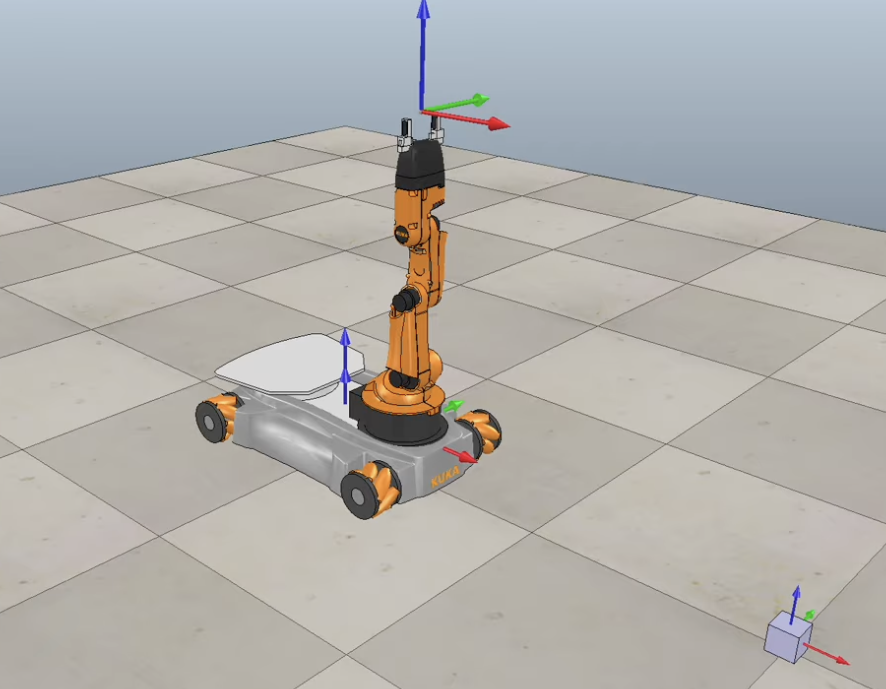

# MAE 204 Final Project

## Summary of Project

This project was completed using a Jupyter Notebook in Python with the assistance of the Modern Robotics, Numpy, and Matplotlib libraries. There were three major functions that were designed to complete the project: TrajectoryGenerator, NextState, and FeedBackControl. The first function that was built was TrajectoryGenerator which took in inputs of various transformation matrices relating to the end effector configurations at each trajectory and outputted the corresponding cartesian trajectories. The second function that was built was the NextState function that took inputs of the current state, velocities, and magnitudes, outputting the next state of the robot based on odometry and elementary Euler steps. The third function that was built was FeedBackControl that took inputs of end effector current and next locations, proportional and integral matrices, and states and angles of the current state, outputting speeds for wheels and the arm, commanded twist, and error twist for plotting purposes. Finally, a wrapper script consisting of feedforward only, best feedback case, overshoot feedback case, and new task feedback case were tested, with their corresponding error twists plotted for analysis purposes. 

FeedBackControl was designed a bit differently than what the instructions suggested: instead of an input consisting of the current, actual end effector configuration, it was calculated within the function using states and joint angles, the body axis twist, and forward kinematics. This was later used for finding the error twist between the desired configuration and the actual configuration. Additionally, the Jacobian was calculated inside the function, instead of outside the function. These differences do not undermine the final result, as the robot is still able to perform the necessary tasks flawlessly; it was more intuitive to perform the calculations internally to ensure the feedback portion of the project worked flawlessly.

The lack of joint limit implementation within the main part of the project was a surprise as they play a significant part in a robot’s performance in real life situations. For certain new case situations where the block was placed at a different location, these joint limits were vital to move the robot without any issues, however it was not implemented in this submission due to additional complexities rising up as a result of attempting to implement that functionality. Velocity limits were implemented, with a higher angular velocity `(100 rad/s)` being permitted for the wheels compared to the arm `(25 rad/s)` because it reflected the more realistic gear ratios for the robot. Earlier in the project, the same angular velocity limit was applied to all joints, but this led to over-actuation of the arm and under-actuation of the chassis since the end effector could travel much farther for an angular velocity on the arm compared to an angular velocity on the chassis. A simple Jacobian singularity avoidance was implemented by introducing a threshold for which the Jacobian would perform calculations. Any values less than the threshold would be set to zero, which would assist in the computation efficiency of the Jacobian. 

## Code 
Please check `[MAE204FinalCode.ipynb](./MAE204FinalCode.ipynb)` for the necessary functions and libraries needed to replicate this project. 

## Results 
 Please view the full report [here](./MAE204Project.pdf)

#### Video Results 
- **Best Case Controller with `Kp = 1.0 and Ki = 0.008` :**  
     
- **Overshoot Controller with `Kp = 2.0 and Ki = 6.0`**  
     
- **Well Tuned Alternate Configuration**  
    
- **Alternate Configuration Overshoot**  
    
